CPESR
================
CPESR
2023-06-28

### Sexe

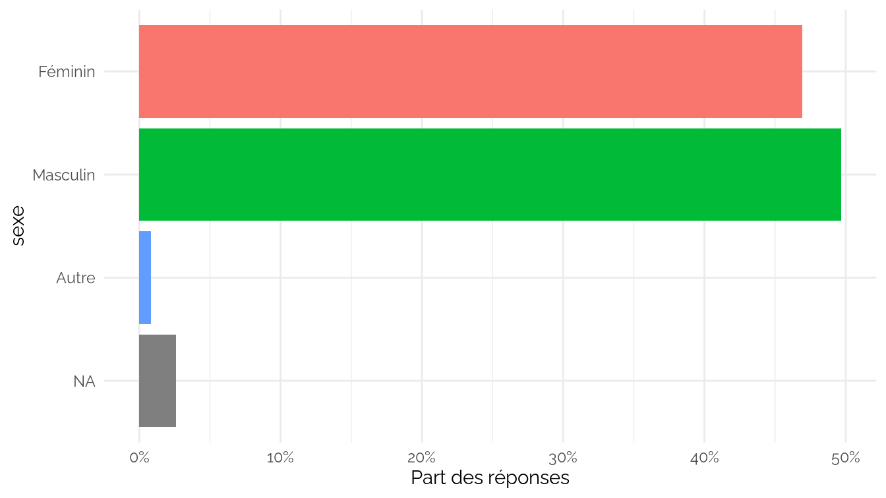

### Age

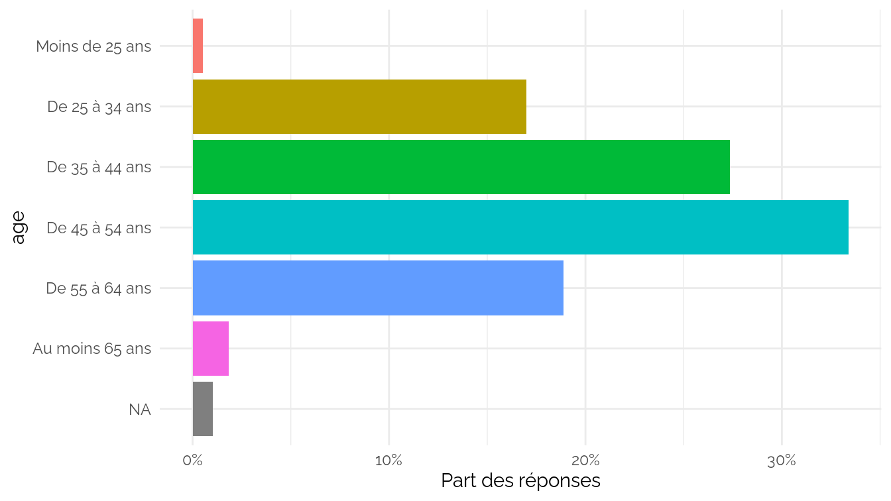

### Ancienneté

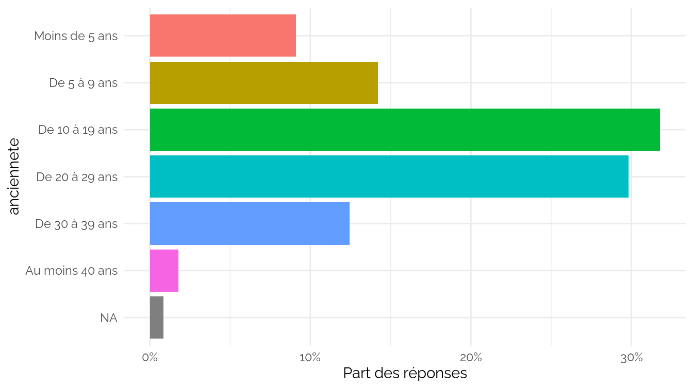

## Métier

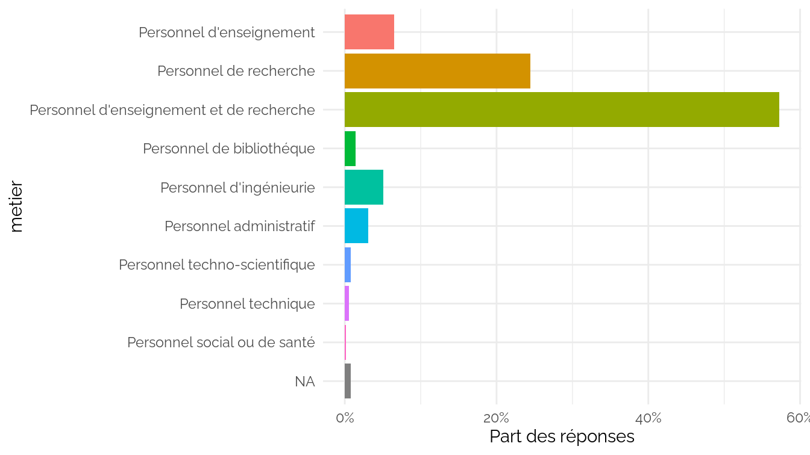

## Discipline

## Catégorie

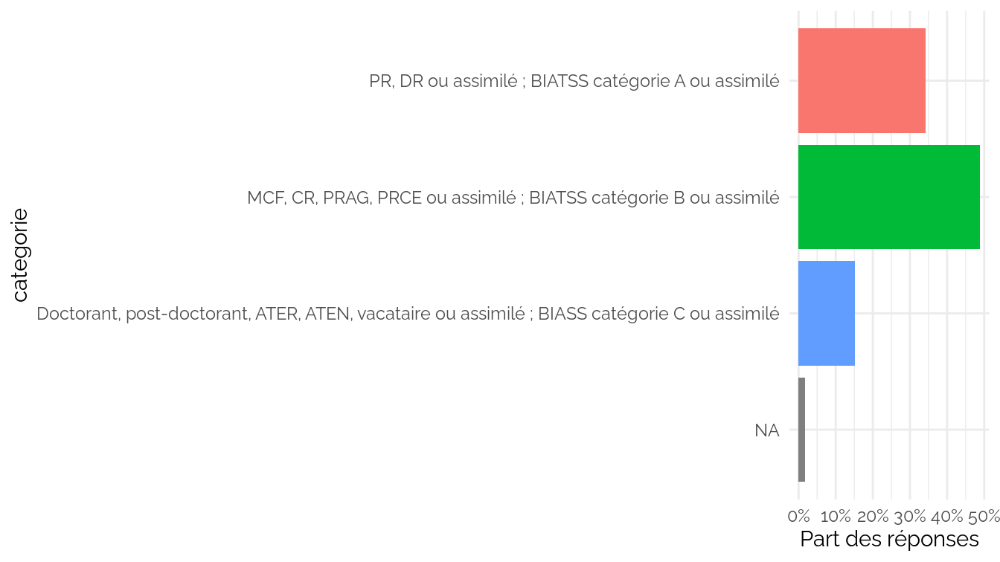

## Statut

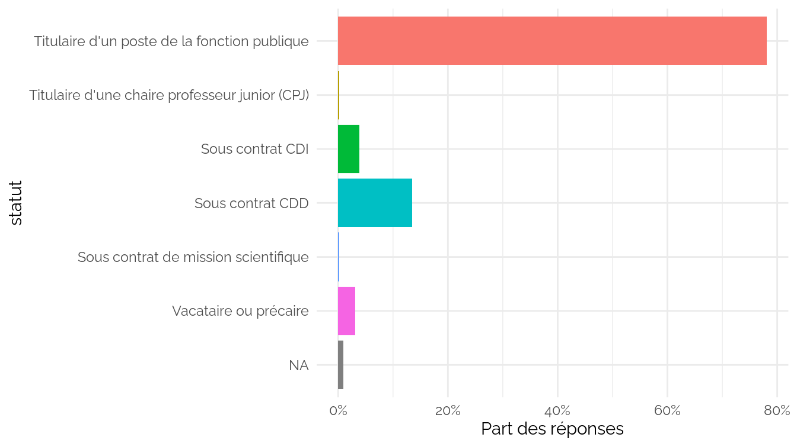

## Secteur

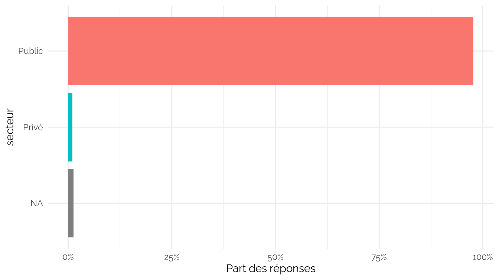

## Responsabilités

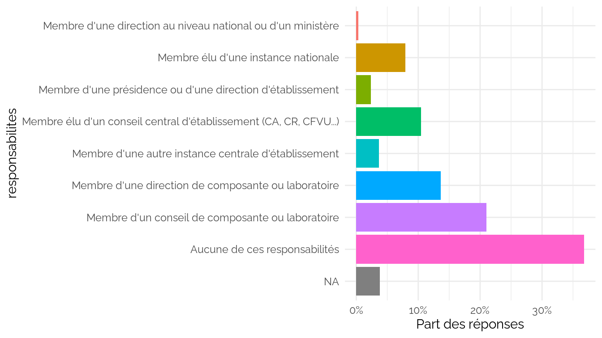

## Conditions de travail

## Evolution des conditions de travail

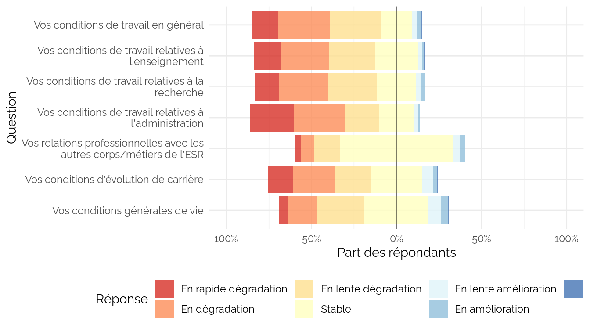

## Optimisme pour l’évolution des conditions de travail

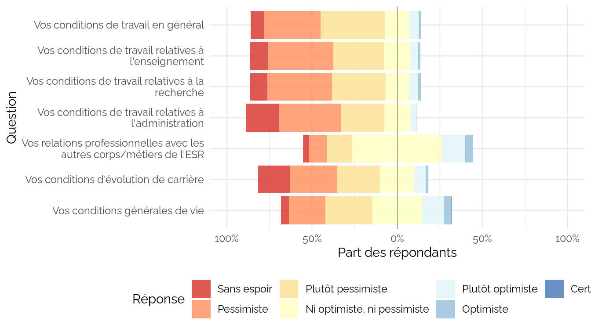

## Confiance

## Réformes

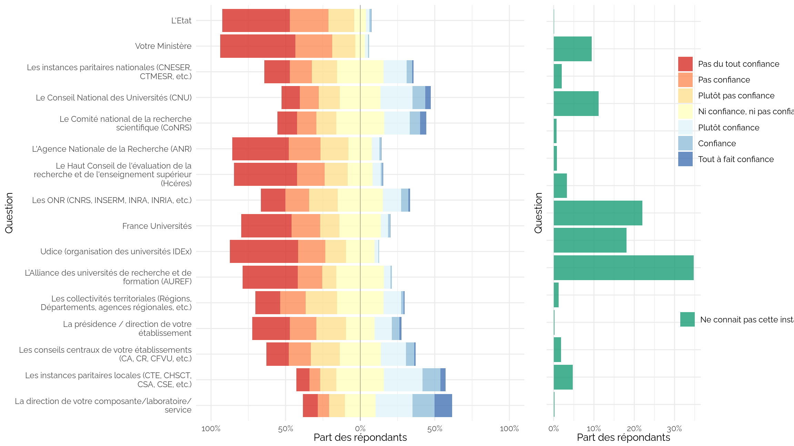
